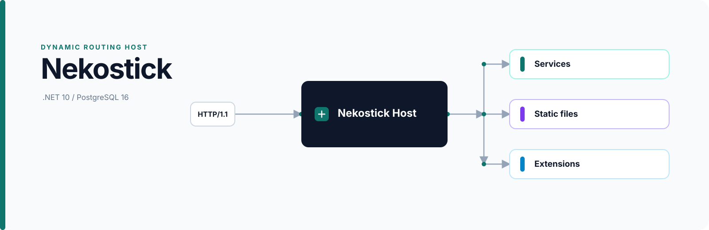

# Nekostick

<p align="center">
  
</p>

<p align="center">
  <strong>A dynamic routing host for microservices</strong><br />
  Safely dispatch HTTP/1.1 traffic to local services, static files, and trusted extensions.
</p>

<p align="center">
  <a href="https://github.com/Nekolla-Team/nekostick/actions/workflows/test.yml"></a>
  <a href="https://www.apache.org/licenses/LICENSE-2.0"></a>
  <a href="https://github.com/Nekolla-Team/nekostick/commits"></a>
  <a href="https://dotnet.microsoft.com/download/dotnet/10.0"></a>
  <a href="https://www.postgresql.org/"></a>
</p>

## Overview

Nekostick is a single-entry dynamic routing host. Route definitions are persisted in PostgreSQL, validated as a complete candidate, compiled into an immutable snapshot, and atomically published. Existing requests continue using their captured snapshot while new requests use the latest accepted configuration.

Supported route targets are:

- **Local microservices**: port leases, health checks, lifecycle management, and HTTP/WebSocket forwarding.
- **Static files**: absolute roots with path containment and traversal protections.
- **Trusted extensions**: unloadable extensions behind the stable `Nekolla.Nekostick.Contracts` ABI, with handlers, fallback, configuration, and event capabilities.

The Host accepts HTTP/1.1 only. TLS termination, authentication, and administrative APIs are intentionally outside the core Host boundary.

## Features

- PostgreSQL persistence with EF Core migrations and advisory-lock startup coordination.
- Immutable route snapshots with deterministic Exact, Prefix, and Regex matching.
- Header and path rewriting, proxy timeouts and retries, client-IP handling, and bounded request resources.
- HTTP and WebSocket forwarding with local process supervision.
- Collectible `AssemblyLoadContext` extension loading with staged reload/unload and ABI compatibility checks.
- Docker, Docker Compose, and Systemd deployment support.

## Requirements

- .NET 10 SDK 10.0.100 or a compatible feature band.
- PostgreSQL 16.
- A supported POSIX runtime environment, currently Linux/macOS.
- (Optional) An external reverse proxy for production TLS termination.

## Usage

### Build and test

```sh
dotnet restore Nekolla.Nekostick.slnx
dotnet build Nekolla.Nekostick.slnx --configuration Release
dotnet test Nekolla.Nekostick.slnx --configuration Release --no-build
```

PostgreSQL integration tests use the `NEKOSTICK_TEST_PG` environment variable. They do not substitute an in-memory provider when PostgreSQL is unavailable, instead bypass directly.

### Run the Host

The Host requires a PostgreSQL connection string before startup. Bootstrap precedence is `CLI > environment > default`.

```sh
export NEKOSTICK_CONNECTION_STRING='Host=127.0.0.1;Port=5432;Database=nekostick;Username=nekostick;Password=change-me'
export NEKOSTICK_NODE_ID='node-1'

dotnet run --project src/Nekolla.Nekostick.Host/Nekolla.Nekostick.Host.csproj -- \
  run --listen-address 127.0.0.1 --listen-port 8080
```

Supported commands:

```text
run       Start the node and serve dynamic routes.
status    Emit non-secret node and configuration status as JSON.
doctor    Check database, migration, and snapshot readiness.
```

Supported run switches:

```text
--skip-extensions       Do not load extensions for this invocation.
--disable-supervisor    Do not manage local microservice processes.
--read-only             Disable configuration writes from this node.
```

The equivalent bootstrap environment variables are:

| Setting | CLI option | Environment variable | Default |
| --- | --- | --- | --- |
| PostgreSQL connection | `--connection-string` | `NEKOSTICK_CONNECTION_STRING` | Required |
| Listen address | `--listen-address` | `NEKOSTICK_LISTEN_ADDRESS` | `127.0.0.1` |
| Listen port | `--listen-port` | `NEKOSTICK_LISTEN_PORT` | `8080` |
| Node identifier | `--node-id` | `NEKOSTICK_NODE_ID` | `0` |

### Docker

Build the Linux amd64 image from the repository root:

```sh
docker buildx build \
  --platform linux/amd64 \
  -f deploy/Dockerfile \
  -t nekostick:local \
  .
```

Start the example Compose deployment:

```sh
docker compose -f deploy/compose.example.yml up --build
```

The Compose example requires `NEKOSTICK_CONNECTION_STRING` and a stable, unique `NEKOSTICK_NODE_ID`. See [`deploy/README.md`](deploy/README.md) for systemd installation, runtime requirements, and operational constraints.

## Extension API

- [Extension API guide](docs/extension-api.md)
- [Contracts package README](src/Nekolla.Nekostick.Contracts/README.md)

Extensions are trusted in-process code. A collectible `AssemblyLoadContext` provides dependency isolation and unloadability; it is not a security sandbox. Manifest validation, capability boundaries, lifecycle behavior, handler semantics, and configuration rules are defined by the [Extension API guide](docs/extension-api.md).

### Consume the Contracts package

The stable Host and extension contract surface is distributed as the `Nekolla.Nekostick.Contracts` NuGet package:

```sh
dotnet add package Nekolla.Nekostick.Contracts --version 1.3.0
```

Extension projects should reference Contracts and their explicitly declared shared-contract assemblies only. They should not reference Host, Persistence, ASP.NET, EF Core, or another extension's implementation assembly.

## Configuration and operations

Business configuration is read from validated PostgreSQL snapshots. Bootstrap settings include `NEKOSTICK_CONNECTION_STRING`, `NEKOSTICK_LISTEN_ADDRESS`, `NEKOSTICK_LISTEN_PORT`, and `NEKOSTICK_NODE_ID`. Do not commit connection strings, secrets, or environment files, and do not write them to logs or diagnostic output.

Operational constraints include:

- Startup applies and validates the EF Core idempotent migration artifact before the Host becomes ready.
- Multi-node deployments require a stable, unique `nodeId` for every node.
- The Host and NativeHelper must be published from the same commit, configuration, and runtime identifier.
- Production deployments should use separate least-privilege runtime and migration credentials where practical.

## Project layout

```text
src/
  Nekolla.Nekostick.Contracts/      Stable Host and extension ABI and DTOs.
  Nekolla.Nekostick.Domain/         Route and bootstrap domain models.
  Nekolla.Nekostick.Routing/        Immutable matching and dispatch snapshots.
  Nekolla.Nekostick.Proxy/          HTTP/WebSocket proxy and static targets.
  Nekolla.Nekostick.Supervision/    Child-process lifecycle and health.
  Nekolla.Nekostick.Extensions/     Manifest, ALC, lifecycle, and capabilities.
  Nekolla.Nekostick.Persistence/    PostgreSQL, EF Core, and migrations.
  Nekolla.Nekostick.Host/           Executable composition root.

tests/                              Unit, integration, and process fixtures.
deploy/                             Docker, Compose, and systemd templates.
docs/                               Technical design and extension API guides.
```

## Documentation

- [Technical design](docs/technical-design.md)
- [Extension API guide](docs/extension-api.md)
- [Deployment artifacts](deploy/README.md)
- [Contracts package](src/Nekolla.Nekostick.Contracts/README.md)

## Development

Keep the Contracts assembly as the stable ABI boundary. Do not expose database connections, EF entities, ASP.NET types, or runtime handles to extensions. Before submitting changes, run the canonical solution restore, build, and test commands. Use a real PostgreSQL instance for integration coverage through `NEKOSTICK_TEST_PG`.

## License

Copyright 2026 Nekolla Team.

Licensed under the Apache License, Version 2.0. See [`LICENSE`](LICENSE) or <https://www.apache.org/licenses/LICENSE-2.0> for the full text.
